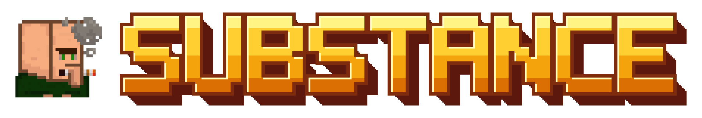
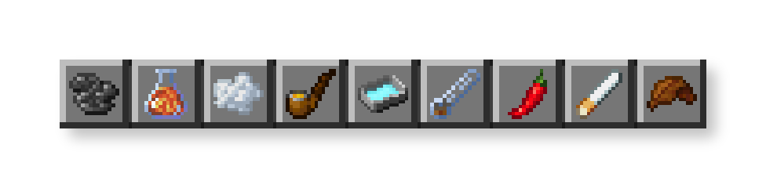
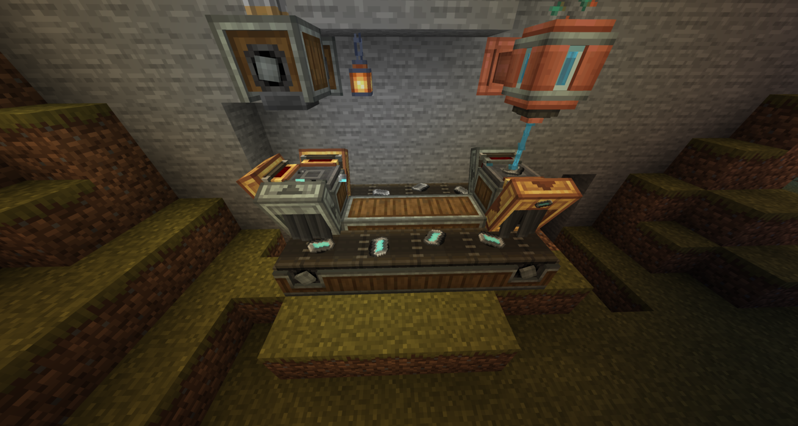

> **Disclaimer:** Substance is a fictional work made for entertainment. It does not want to encourage or promote real-life drug use, unsafe behavior, or illegal activity in any way.

**Substance** is a humorous Minecraft mod that adds items inspired by ***Breaking Bad*** and other consumable items.
Grow or find ingredients, process them through multistep production chains, and use the finished products for distinct gameplay, visual, and audio effects.

## What the mod adds

- Growable herb, tobacco, ephedra, and chili plants
- Herbal rolls, cigarettes, crystals, and reusable pipes
- White and blue crystal production chains using flasks, gas bottles, chemical fluids, and drying trays
- Seven custom effects: Haze, Warp, Keen, Relaxation, Surge, Hallucination, and Dread
- Custom post-processing shaders, audio effects, ambient sounds, and apparitions
- Normal, extended, strong, splash, and lingering potions for every effect
- New villager and wandering trader offers, chest loot, piglin bartering, and mob equipment
- An advancement tree that guides you through farming, smoking items, pipes, chemistry, and effects
- Server-synchronized gameplay settings and separate client controls for visual and audio effects

## Optional Create integration

[Create Fabric](https://modrinth.com/mod/create-fabric) adds mechanical processing and automation for many production steps.

Create is optional. Substance includes manual recipes using flasks for its progression and automation using dispensers when Create is not installed.

## Requirements

- Minecraft 1.20.1
- Fabric Loader 0.19.2 or newer
- Java 17 or newer
- [Fabric API](https://modrinth.com/mod/fabric-api)
- [Yet Another Config Lib (YACL)](https://modrinth.com/mod/yacl) 3.6.6 or newer

[Mod Menu](https://modrinth.com/mod/modmenu) is optional and provides in-game access to Substance's configuration screen.

Most recipes & custom intercarions can be viewed with EMI, JEI, or REI.

Only Fabric 1.20.1 is supported at present. Support for newer Minecraft versions and NeoForge is planned, but not guaranteed.

## Guides and links

- [Content overview](https://github.com/Jojoaky/Substance/blob/master/docs/content.md)
- [Effects and potions](https://github.com/Jojoaky/Substance/blob/master/docs/effects.md)
- [Pipes](https://github.com/Jojoaky/Substance/blob/master/docs/pipes.md)
- [White Crystal production](https://github.com/Jojoaky/Substance/blob/master/docs/white-crystals.md)
- [Blue Crystal production](https://github.com/Jojoaky/Substance/blob/master/docs/blue-crystals.md)
- [Herbal rolls](https://github.com/Jojoaky/Substance/blob/master/docs/herbal-rolls.md)
- [Cigarettes](https://github.com/Jojoaky/Substance/blob/master/docs/cigarette.md)
- [Configuration reference](https://github.com/Jojoaky/Substance/blob/master/docs/configuration.md)
- [Source code & issue tracker](https://github.com/Jojoaky/Substance)

## Credits

Jojoaky developed most of the code, and Zute created most of the textures. The chemistry content draws inspiration from [Create: Broken Bad](https://www.curseforge.com/minecraft/mc-mods/create-broken-bad), and the herbs draw inspiration from [Nirvana](https://www.curseforge.com/minecraft/mc-mods/nirvana).

Some sound effects come from [Freesound](https://freesound.org/) and are used under various Creative Commons licenses or CC0. Individual credits are listed in the [third-party audio attributions](https://github.com/Jojoaky/Substance/blob/master/THIRD_PARTY_LICENSES.md).
